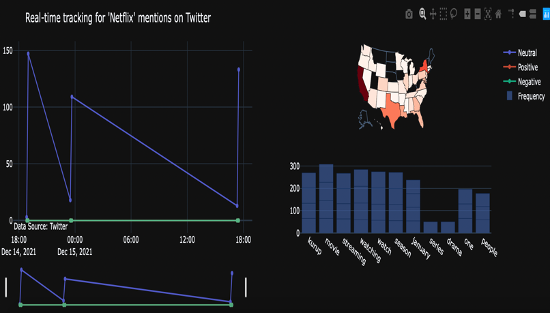

# Tweeper

Real time analysis of twitter data using tweepy and docker. 

## Problem statement
Twitter produces enormous amounts of messages each day, and its user base has been steadily expanding. These tweet data can effectively be utilized to deduce a range of information, including business trends, weather updates, stock prices, significant events, etc. In this project, our main emphasis will be on conducting a sentiment analysis to examine the tweets and ultimately extract business-specific trends and weather information from them.

## Solution
We may derive helpful conclusions from the visualizations, such as how the product is performing based on user tweets and what the user's current preferences are for the program. These findings can serve as the basis for scaling and creating a trend analysis tool that can monitor changes in a specific area and target the appropriate demographic.

## Proposed Method
* The listener class separates the data into distinct company relevant data (Amazon, Google, Apple, Netflix), and weather related data. The tweets are broadcast from the Twitter end points.

* These real-time data is ingested into tables with the names indicated in the diagram on the Google Cloud POSTGRES server.

* The data is then pulled from the normalized tables and subjected to sentiment analysis. The polarity and subjectivity of the tweets are determined with the aid of [TextBlob](https://textblob.readthedocs.io/en/dev/). As a result, we now know how many times the firm name was mentioned in tweets that were positive, bad, or neutral.

* The frequency distribution of the words relative to the firm was calculated along with the polarity of the tweets. This helps us get a sense of what words are popular right now and how they are dispersed geographically.

* In a similar manner, the temperature, wind speed, and wind direction for the hourly weather forecast were also taken from the tweets.

* The data for both the weather updates and the sentiment frequency distributions are then written back to the results table in PG.

* Using plotly, the outputs were turned into visualizations, and an app was made to display the plots and run on the Heroku pipeline.

## Results

### Weather Trends

Weather updates and the trend over a time frame 

### Tweet Trends for apple

Tweet trends in terms of polarity of the tweets and frequency distribution of key 

### Tweet trends for a key word

